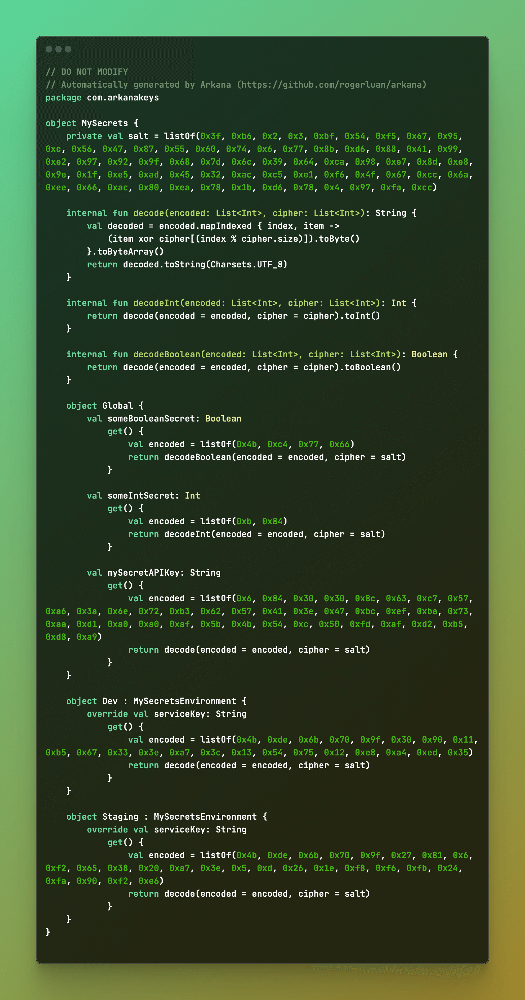
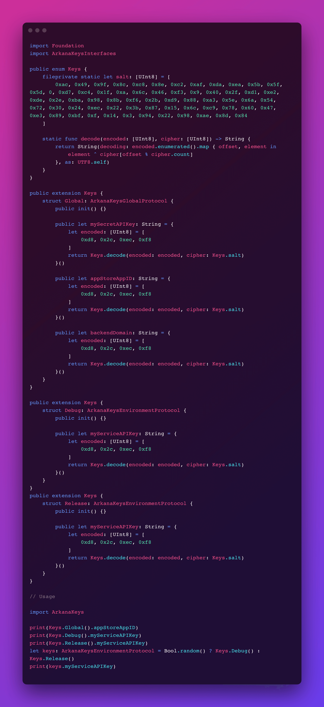

<div align="center">
  
  <h1>Arkana</h1>
  <p>noun ‧ secret knowledge<a href="https://en.wiktionary.org/wiki/arkana">¹</a> — ar‧ka‧na | \är-​ˈkā-​nə\</p>
  <p><strong>Store your keys and secrets away from your source code. Designed for Android and iOS projects.</strong></p>
  <a href="https://github.com/rogerluan/arkana/releases">
    
  </a>
  <a href="https://codeclimate.com/github/rogerluan/arkana/maintainability">
    
  </a>
  <a href="https://codeclimate.com/github/rogerluan/arkana/test_coverage">
    
  </a>
  <a href="https://github.com/rogerluan/arkana/actions/workflows/push.yml">
    
  </a>
  <a href="https://github.com/rogerluan/arkana/actions/workflows/swift-tests.yml">
    
  </a>
  <a href="https://github.com/rogerluan/arkana/issues">
    
  </a>
  <a href="https://twitter.com/intent/follow?screen_name=rogerluan_">
    
  </a>
  

  <p align="center">
    <a href="#preview">View Demo</a>
    ·
    <a href="https://github.com/rogerluan/arkana/issues/new/choose">Report Bug</a>
    ·
    <a href="https://github.com/rogerluan/arkana/issues/new/choose">Request Feature</a>
  </p>
</div>

# Requirements

## Android

Your project must be using the Gradle Build Tool.

## iOS

Your project must be using Swift Package Manager or CocoaPods as dependency manager (or both). No support for Carthage.

<sub>Note: this gem was only tested in macOS environments.</sub>

## Preview

### Kotlin

<details><summary>Click here to see the Kotlin preview</summary>
<p>

The image below shows how the auto-generated file looks like.

<div align="center">
  
</div>

Usage using the example code above:

```kotlin
import com.arkanakeys.MySecrets

// Designed with testability and DI in mind
println(MySecrets.Global.someBooleanSecret)
println(MySecrets.Global.someIntSecret)
println(MySecrets.Global.mySecretAPIKey)

// Simulating environment selection using a random boolean value
val keys = if (Math.random() < 0.5) MySecrets.Dev else MySecrets.Staging
println(keys.serviceKey)
```

</p>
</details>

### Swift

<details><summary>Click here to see the Swift preview</summary>
<p>

The image below shows how the auto-generated file looks like.

<div align="center">
  
</div>

Usage using the example code above:

```swift
import ArkanaKeys

// Designed with testability and DI in mind
print(MySecrets.Global().someBooleanSecret)
print(MySecrets.Global().someIntSecret)
print(MySecrets.Global().mySecretAPIKey)

// This is a demo, so we are using Bool.random() to simulate the environment
let keys: MySecretsEnvironmentProtocol = Bool.random() ? MySecrets.Dev() : MySecrets.Staging()
print(keys.serviceKey)
```

</p>
</details>

# Installation

Add this gem to your `Gemfile` if you're using [bundler](https://bundler.io) (recommended):

```ruby
gem 'arkana'
```

And then run `bundle install` to install it.

Alternatively, you can install it in your entire system instead (not recommended):

```ruby
gem install arkana
```

# Basic Usage

Arkana requires the declaration of a YAML config file. Although you can name it whatever, the convention is to name it `.arkana.yml`. See [template.yml](/template.yml) for complete options.

Once you have created your config file, you can run Arkana:

```sh
Usage: arkana [options]
    -c /path/to/your/.arkana.yml,    Path to your config file. Defaults to '.arkana.yml'
    -e /path/to/your/.env,           Path to your dotenv file. Defaults to '.env' if one exists.
    -l kotlin                        Language to produce keys for, e.g. kotlin, swift. Defaults to 'swift'.
```

> [!NOTE]
> For the complete set of args, look at the [options](#options) section.

## Config File

The `arkana.yml` would typically contain 3 important sections:

- **Environments**: This is typically where you specify `debug`, `release` or other environments which you wish to create.
- **Environment Secrets**: This is where you declare the keys which will be ultimately exposed to your app, like `apiKey`.
- **Global Secrets**: Here you'd declare keys which are the same across all environments.

## Environment File

The environment (`.env`) file contains the actual secrets for each environment. While config file declares the keys, they are assigned encrypted values from this file.

This file is optional, but quite handy in local development. `.env` files shouldn't be committed as they contain your secrets. Instead, they should be stored in a secure location, like your CI/CD server as environment variables (all CI/CD servers have a way to store secrets securely). See [Continuous Integration](#continuous-integration) for more information.

### Sample

A config file as shown below:

```yaml
environments:
  - Release
  - Debug
environment_secrets:
  - apiKey
global_secrets:
  - clientId
```

Coupled with an env file:

```properties
apiKeyDebug = "your_debug_api_key"
apiKeyRelease = "your_release_api_key"
clientId = "your_client_id"
```

Would generate the following accessors:

```swift
// Swift
public extension ArkanaKeys {
    struct Global: ArkanaKeysGlobalProtocol {
        public let clientId: String = {<decrypted accessor>}
    }
}
public extension ArkanaKeys {
    struct Release: ArkanaKeysEnvironmentProtocol {
        public let apiKey: String = {<decrypted accessor>}
    }
}
public extension ArkanaKeys {
    struct Debug: ArkanaKeysEnvironmentProtocol {
        public let apiKey: String = {<decrypted accessor>}
    }
}
```

Note that you have to prepend `bundle exec` before `arkana` if you manage your dependencies via bundler, as recommended.

Arkana only has one command, which parses your config file and env vars, generating all the code needed. Arkana should always be run before attempting to build your project, to make sure the files exist _and_ are up-to-date (according to the current config file). This means you might need to add the Arkana run command in your CI/CD scripts, _fastlane_, Xcode Build Phases, or something similar.

## Importing Arkana into your iOS project

Once the Arkana has been run, its files will be created according to the `package_manager` setting defined in your config file, so update that setting according to your project needs.

### Via Swift Package Manager

If you're integrating Arkana via SPM (`package_manager` is set to `spm`), Arkana will generate its files as a local Swift Package.

You can add this package in an Xcode project or as a dependency of another Swift Package:

#### Adding a local Swift Package to your Xcode project

1. Choose <kbd>File</kbd> → <kbd>Add Packages…</kbd> and click on <kbd>Add Local…</kbd>. Locate and select the `ArkanaKeys` folder (or the name of the `import_name` option that you passed in your config file).
    - If you happen to have 2 nested folders with the same name `ArkanaKeys`, select the inner one.
1. Select your project in the Project navigator, then select your app target and navigate to its General pane.
1. Click the <kbd>+</kbd> button in the `Frameworks, Libraries, and Embedded Content` section, select the local package’s library product, and add it as a dependency.
    - You may need to quit Xcode and re-open the project for the new dependency to be recognized. Classic Xcode fashion.

#### Adding a local Swift Package to another Swift Package

Add `ArkanaKeys` (or the name of the `import_name` option that you passed in your config file) to your list of dependencies in your `Package.swift` file, like this:

```swift
…
dependencies: [
    …
    .package(name: "ArkanaKeys", path: "path/to/your/dependencies/ArkanaKeys"),
    …
],
…
```

### Via CocoaPods

If you're integrating Arkana via CocoaPods (`package_manager` is set to `cocoapods`), Arkana will generate its files as a Development Pod.

Add `ArkanaKeys` and `ArkanaKeysInterfaces` (or the `pod_name` option that you passed in your config file) to your list of dependencies in your `Podfile` file, like this:

```ruby
pod "ArkanaKeys", path: "path/to/your/dependencies/ArkanaKeys"
pod "ArkanaKeysInterfaces", path: "path/to/your/dependencies/ArkanaKeysInterfaces"
```

After adding its dependency, you should be able to `import ArkanaKeys` (or the `import_name` option that you passed in your config file).

We recommend you to add your ArkanaKeys directory to your `.gitignore` since it's an auto-generated code that will change every time you run Arkana (since its salt gets generated on each run). For more information, see [How does it work?](#how-does-it-work)

## Importing Arkana into your Android project

When importing Arkana into your project, you have two options: generating its files within a new Gradle module created by Arkana, or adding them to an existing module. The choice depends on the settings in your config file, so ensure these are updated to reflect your project's requirements.

### Creating a New Arkana Gradle Module

To generate a new Gradle module containing Arkana files, follow these steps:

1. In your config file, set the `result_path` to the desired name for the new Arkana module.
2. Update your project's `settings.gradle` file to include this newly created Arkana module.

### Adding Arkana to an Existing Gradle Module

If you prefer to add Arkana files to an existing Gradle module, follow these steps:

1. Adjust the `result_path` in your config file to specify the existing Gradle module where you want to include the Arkana files.
2. Change `should_generate_gradle_build_file` to `false`. This prevents the overwriting of your existing module's `build.gradle` file.

### Automating Arkana Execution During Gradle Sync

For automatic execution of Arkana during Gradle sync, modify your `settings.gradle` file by adding the following code:

```kotlin
exec {
    commandLine("arkana", "--lang", "kotlin")
}
```

## Options

### `--help`

Will display a list of the available options.

### `--lang`

Usage: `--lang kotlin`

Indicates the language to produce keys for, e.g. kotlin, swift.

Defaults to `swift`.

### `--config-file-path`

Usage: `--config-file-path /path/to/your/.arkana.yml`

Indicates where your config file is located at.

Defaults to `.arkana.yml` in the current directory.

### `--dotenv-file-path`

Usage: `--dotenv-file-path /path/to/your/.env`

Indicates where your .env file is located at, if you have any to be loaded.

Defaults to `.env` in the current directory.

### `--flavor`

Usage: `--flavor loremipsum`

Passing a flavor option will change the env var lookup mechanism. Flavors are useful, for instance, when generating secrets for white-label projects.

### `--include-environments`

Usage: `--include-environments dev,staging,prod`

Passing an `--include-environments` option will change the env var lookup mechanism. This option is useful when you want to generate secrets for specific environments only, and skip the verification that checks whether all keys from all environments are present. You might want to use this option to only build debug environments locally (and thus only require debug env vars), and only build staging and production environments in CI (and thus only expose prod env vars to your CI).

Defaults to `nil`, which means all your environments will be used. When passing multiple values, separate them with commas and no spaces.

#### Example

Let's load a flavor called `snowflakes` and load a secret called `MySecretAPIKey`:

Run `bundle exec arkana --flavor snowflakes`

This will change the env var lookup method, to this particular order:

1. Load any `.env` file, if present.
2. Load any `.env.snowflakes`, if present (it will override the keys of `.env` when they conflict)
3. Look up for a `SnowflakesMySecretAPIKey` env var. This could be present anywhere: both in the `.env` file, or in actual env vars (useful for CI environments).
4. If `SnowflakesMySecretAPIKey` didn't exist, look up for a `MySecretAPIKey` env var.
5. If ultimately it couldn't find any env var to populate the key `MySecretAPIKey`, it will throw a validation error.

This means that, if you are working with a white-label project, you can have all your env vars declared in a single `.env` file, or in multiple files like `.env.snowflakes`, `.env.frosties`, etc. This also means that your CI can be configured with the appropriate env vars e.g. `SnowflakesMySecretAPIKey`, `FrostiesMySecretAPIKey`, etc, with no necessity to manage (or git-version) dotenv files at all, which is the ideal way to manage secrets securely in a project.

# Advanced usage

## Continuous Integration

We advise you not to commit your `.env` files, because of security concerns. They should live in secure Environment Variables in your build (CI/CD) server instead.

Following the [template.yml](template.yml) example file, these would be the variables that would need to be added to your build server env vars:

- `FrootLoopsAppStoreAppID`
- `FrootLoopsBackendDomain`
- `FrootLoopsMySecretAPIKey`
- `FrootLoopsMyServiceAPIKeyDebug`
- `FrootLoopsMyServiceAPIKeyRelease`
- `FrostedFlakesAppStoreAppID`
- `FrostedFlakesBackendDomain`
- `FrostedFlakesMySecretAPIKey`
- `FrostedFlakesMyServiceAPIKeyDebug`
- `FrostedFlakesMyServiceAPIKeyRelease`

It's okay to commit your `.env` files if their potential exposure wouldn't be harmful to your project, for instance when Arkana is being used in a white label project to inject variables but that are not necessarily "secrets" (e.g. app tint color, server domain, etc). You can also use `.env` files to store part of your env vars (only the unsecure ones), and keep the secrets in your build server's env vars.

## Monorepo

If your repository makes use of a [monorepo](https://monorepo.tools/#what-is-a-monorepo) structure, then we recommend using Arkana by defining multiple `.env` files and multiple `.arkana.yml` configuration files, as it's how it was designed to be used.

One of the goals of Arkana was to use the least dotfiles as possible. This made a significant difference when designing for white-label projects (aka project flavors), because traditional dotenv implementation would suggest having multiple dotenv files such as `.env.frootloops` and `.env.frosted` if you had 2 different flavors (note that you can still use multiple dotenv files if you want so (see usage of the `--flavor` option). But what if you're a big agency that distributes to 25, 50, 200 clients? Maybe you don't want to be managing the distribution of 200 dotenv files across your team, and Arkana was designed with that in mind.

However, when it came to monorepo structures, we weighted the pros and cons of both approaches, and ultimately decided to the simplicity of having a set of dotfiles for each individual project, in their respective directory. The reason main reasons were:

- the scale here is different: a project may have hundreds of flavors, but not that many projects.
- each project already has its own dotfiles in its root directory, most likely, including `.env` files, and with Arkana it wouldn't be any different.
- each project has its own quirks, so it's more scalable to put the responsibility on the project's directory to deal with its own dotenv files than to have a centralized file that would coordinate each project.
- the complexity of maintaining a centralized configuration file that manages all projects would be too high to be implemented in Arkana. We aim for simplicity.

If you have questions on how to set this up, feel free to open an issue and we can clarify further how this can be set up.

## Presence of special characters in your env vars

### Dollar sign

This project is implemented in Ruby and uses the [`dotenv`](https://github.com/bkeepers/dotenv) gem. Since `dotenv` [follows bash implementation as close as possible](https://github.com/bkeepers/dotenv/issues/214), dollar signs (`$`) need to be escaped unless they are in single quotes.

For example, these are all valid:

```ruby
SecretWithDollarSignEscapedAndAndNoQuotesKey = real_\$lim_shady
SecretWithDollarSignEscapedAndDoubleQuoteKey = "real_\$lim_shady"
SecretWithDollarSignNotEscapedAndSingleQuoteKey = 'real_$lim_shady'
```

These are not valid:

```ruby
SecretWithDollarSignNotEscapedAndDoubleQuotesKey = "real_$lim_shady"
SecretWithDollarSignNotEscapedAndNoQuotesKey = real_$lim_shady
```

When storing your secret in actual env vars (instead of dotfiles), you will most likely need to escape them too.

### Other characters to avoid

- `\` aka backslash: double scaping will be needed
- `"` aka double quotes: escaping is needed

### Other common special characters that are fine to be used

```txt
` ~ ! @ # % ^ & * ( ) _ - + = { [ } } | : ; ' < , > . ? /
```

# FAQ

## How does it work?

Arkana uses code generation to provide your app with its secrets. Secrets are fetched from env vars during Arkana runtime (not your app's runtime), their values are encoded using a salt that is generated on each run, and source code is generated using the provided keys, and the generated encoded values.

During your app's runtime, the encoded value is decoded so your app can use their raw values (the values that were originally stored in your env vars).

This encoding mechanism makes it difficult for attackers to simply just read your secrets in plain text from your app's binary (for instance by using unix [strings](https://man7.org/linux/man-pages/man1/strings.1.html), or other tools like [dumpdecrypted](https://github.com/stefanesser/dumpdecrypted)).

## Is this safe?

Key security is difficult. Right now even the biggest apps get their keys [leaked](https://threatpost.com/twitter-oauth-api-keys-leaked-030713/77597). This is neatly summed up by John Adams of the Twitter Security Team on [Quora](http://www.quora.com/Twitter-1/How-were-the-Twitter-iPhone-and-Android-OAuth-keys-leaked).

> Putting this in the context of, "should you be storing keys in software", is more appropriate. Many companies do this. It's never a good idea.
>
> When developers do that, other developers can use debuggers and string searching commands to extract those keys from the running application. There are numerous talks on how to do that, but leave that as an exercise to the reader to find those talks.
>
> Many people believe that obfuscating these keys in code will help. It usually won't because you can just run a debugger and find the fully functional keys.

So in summary, the ideal way to store keys is to not store keys. In reality though most Apps embed keys, and this does that and adds some rudimentary obfuscation to the keys. A well motivated app cracker could probably extract this within a few minutes however.

<sub>This excerpt has been copied in its entirety from https://github.com/orta/cocoapods-keys#security - 100% credit goes to [@orta](https://twitter.com/orta) and its maintainers.</sub>

## Why not [`cocoapods-keys`](https://github.com/orta/cocoapods-keys)?

I decided to create this new gem because `cocoapods-keys` wasn't enough for all my (and other `cocoapods-keys` users') needs. The key differences between these two projects are:

- The code generation process generates a more modern interface and protocols, under a friendly and customizable namespace, with unit tests written in the output language, and modularized architecture.
- Flexibility: it's independent from CocoaPods. It's a CLI tool, which may or may not be used alongside CocoaPods, but also supports Swift Package Manager.
- Extensibility: can be extended to generate secrets for Android projects as well as iOS ones.
- Conciseness: built-in support for white-label projects and environment-specific secrets, properly making use of interfaces, and reducing amount of boilerplate configuration code to be written.

## Why not a CocoaPods Plugin?

Because plugins can only be hooked to Podfiles, and not Podspec files. Thus, if you have local CocoaPods and rely only on their podspec files to generate their content, but **_they_** are consuming the secrets, then you're out of luck. The strategy that Arkana uses requires a little bit more manual work (1 LOC), but it's more flexible, reaching more projects with different setups.

If your setup uses CocoaPods, you can add this snippet at the top of your Podfile that would work just like a CocoaPods Plugin:

```ruby
`bundle exec arkana --config-filepath /path/to/your/.arkana.yml --dotenv-filepath /path/to/your/.env`
```

<sub>Note: include the back-ticks above, they're required, so that Ruby interprets the snippet as a shell script.</sub>

By doing this, your Arkana code generation will be executed everytime you run `pod install` or `pod update`.

The only down side of using this strategy is that you wouldn't want to use it if you need to pass in (dynamic) flavors, since it would require you to modify the Podfile on every different flavor you need to build. If that's the case, you should run Arkana before running `pod install` in your build pipeline, and not use this snippet at all.

# References

**Did you know?**

The word arcanum (pluralized as "arcana", here spelled as "Arkana") came from Latin arcanus, meaning "secret", and entered English as the Dark Ages gave way to the Renaissance.[²](https://www.merriam-webster.com/dictionary/arcanum)

Special thanks to [@danilobecke](https://github.com/danilobecke) for the inspiration and heavy lifting, and to [@orta](https://twitter.com/orta) for the creation of https://github.com/orta/cocoapods-keys which this project is based off of.

# Development

After checking out the repo, run `bin/setup` to install dependencies. Then, run `bundle exec rake spec` to run the tests. You can also run `bin/console` for an interactive prompt that will allow you to experiment.

To install this gem onto your local machine, run `bundle exec rake install`.

To bump the lib's version, run `bundle exec rake bump[1.2.3]` (replacing the value with the desired version).

To release a new version, make sure the version number in `version.rb` is the one you want to release (after setting it via `bundle exec rake bump` as shown above), and then run `bundle exec rake release`, which will create a git tag for the version, push git commits and the created tag, and push the `.gem` file to [rubygems.org](https://rubygems.org).

# Contributing

Contributions to Arkana are warmly welcomed. Whether it's bug reports, feature requests, or code contributions, your input is highly valued. Please feel free to submit issues and pull requests with your ideas and I promise to get back to you within 24 hours! 😇

This project is intended to be a safe, welcoming space for collaboration, and contributors are expected to adhere to the [code of conduct](CODE_OF_CONDUCT.md).

For a list of issues worth tackling check out: https://github.com/rogerluan/arkana/issues

# Popularity


# Explore my other tools


Forget about 'When did release v2.1.3 go live again?' and 'Is the app ready to be tested yet?'

Statused monitors App Store Connect and send you notifications directly on Slack.

Learn more: [statused.com](https://statused.com?ref=arkana)

# License

This project is open source and covered by a standard 2-clause BSD license. That means you can use (publicly, commercially and privately), modify and distribute this project's content, as long as you mention **Roger Oba** as the original author of this code and reproduce the LICENSE text inside your app, repository, project or research paper.

# Contact

Twitter: [@rogerluan_](https://twitter.com/rogerluan_)
